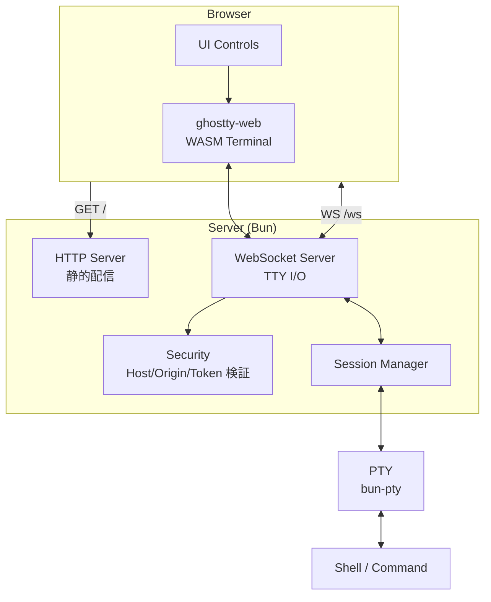
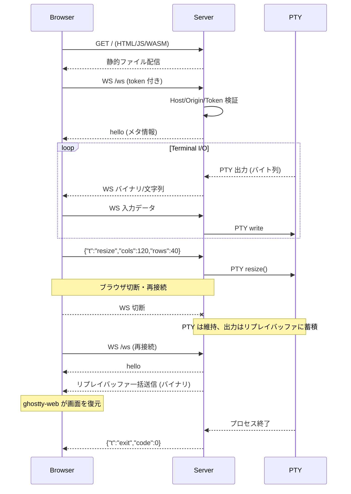

# kastty - Design

## Overview

**kastty** は、ローカルで起動したターミナル（PTY）をブラウザで表示・操作できる **ローカル専用のターミナル共有ツール** である。
主用途は MTG での画面共有・デモ・ペア作業補助であり、rtty / gotty / ttyd 系の思想をベースに、表示品質を重視した「見せるためのターミナル」を提供する。

v1 では Bun + ghostty-web を採用し、`127.0.0.1` のみに bind するローカルサーバとして動作する。HTTP/WS は `Bun.serve()` ネイティブ API で処理し、フロントエンドは Bun HTML imports で自動バンドルする。PTY 操作には bun-pty を使用する（[ADR-0009](../adr/0009-replace-bun-terminal-with-bun-pty.md)）。対象 OS は macOS / Linux（POSIX）。

## Goals

### 機能目標

- ローカルで起動した shell / CLI をブラウザで開ける
- ブラウザからターミナル入力ができる
- ブラウザサイズに応じて PTY をリサイズできる
- 表示品質の高い端末描画（ghostty-web）
- MTG 向けの見せやすい UI（プレゼン寄り）

### UX 目標

- 起動 1 コマンドで使える
- ブラウザが自動で開く（任意）
- デモ用途に必要な操作（readonly、フォント拡大）がすぐ使える
- 意図しない第三者アクセスを防ぐ（localhost 用途でも最低限の防御）

### 技術目標

- 実装をシンプルに保つ（Bun の強みを活かす）
- 将来 Go / Rust へ移植可能なように、プロトコルと責務分離を明確化する
- Bun 固有 API 依存を PTY アダプタ層に閉じ込める

## Non-Goals

v1 では以下をスコープ外とする：

- インターネット公開 / リモートホスティング用途
- 認証基盤（OAuth, SSO 等）
- 複数ユーザー権限管理
- 完全なセッション復元（サーバ側 VT パーサによる画面状態の解析・保持）。再接続時の画面復元は出力リプレイバッファで対応する（PTY 仕様を参照）
- Windows 対応（POSIX PTY 制約のため）
- tmux 代替のような多ペイン / 多セッション管理
- SSH クライアント機能（まずはローカル PTY に集中）

## Background

### 既存ソリューションの課題

既存のターミナル画面共有には以下の課題がある：

- 画面共有時にターミナルのフォントや表示領域が小さい
- ローカル端末の状態をそのまま見せると余計なウィンドウ / UI が映る
- xterm.js 系で表示互換性や文字描画に不満が出るケースがある
- デモ中に誤入力が起きるリスクがある

kastty はこれらに対して、「見せるためのターミナル」をローカルで即座に開くことで、デモ / 共有体験を改善する。

### 命名

- `cast` + `tty` の意味をベースにしつつ、既存 `castty` 名との衝突を回避
- 「彁（か）」の幽霊文字インスパイアを裏テーマにし、ghostty-web 採用とも相性が良い

## Design

### システム構成



### データフロー



### 技術スタック（v1）

| レイヤー | 技術 | 選定理由 |
|---------|------|---------|
| Runtime | Bun | 単体実行ファイル化（`--compile`）で配布しやすい。HTTP/WS サーバーや HTML imports 等のネイティブ API が充実 |
| HTTP / WS | `Bun.serve()` ネイティブ API | ルートが 3 つと単純なため、フレームワーク不要。HTML imports による自動バンドル・HMR も活用できる（[ADR-0008](../adr/0008-remove-hono-use-bun-native.md)） |
| Frontend bundling | Bun HTML imports | `import page from "./index.html"` + `routes` でビルドステップ不要。TypeScript の自動バンドルと開発時 HMR を提供 |
| Terminal rendering | ghostty-web | xterm.js 互換 API で移行しやすく、表示品質改善の期待値が高い |
| Protocol | WebSocket | 単一接続、双方向リアルタイム通信 |
| PTY | bun-pty | Bun 向け PTY ライブラリ。`Bun.Terminal` のバグ回避のため採用（[ADR-0009](../adr/0009-replace-bun-terminal-with-bun-pty.md)） |
| Default font | M PLUS 1 Code (Variable) + Symbols Nerd Font Mono | CJK 対応等幅フォント + Nerd Font アイコン。npm パッケージ + リポジトリ同梱 WOFF2 で CDN 非依存（[ADR-0010](../adr/0010-bundled-fonts-m-plus-1-code-and-nerd-fonts.md)） |

### CLI 仕様

```
kastty                        # デフォルト shell を起動
kastty -- cmd args...         # 任意コマンド起動
kastty --readonly             # readonly モードで起動
kastty --port 0               # ポート自動採番
kastty --open=false           # ブラウザ自動起動を無効化
```

起動時の動作：

1. `127.0.0.1` で listen（デフォルト）
2. ランダム高エントロピートークンを生成
3. shell / command を PTY 付きで起動
4. URL を表示（例: `http://127.0.0.1:54321/?t=...`）
5. ローカルブラウザを開く（`--open=false` で無効化可能）

### ブラウザ UI 仕様

#### P0（v1 必須）

- 端末表示（ghostty-web）
- 接続状態表示（connecting / connected / disconnected）
- タブタイトル追従（OSC タイトルを反映。connecting は `🟡`、disconnected は `🔴` を先頭表示）
- フォントサイズ調整（+/-）
- readonly 切替

#### P1（v1.1）

- プレゼンモード（ヘッダ / 余白最適化、UI 非表示）
- 背景 / テーマ切替
- コピー専用モード（入力無効化、keydown 遮断）

#### P2（将来）

- パターンマスキング（API キー等）
- 観客ビュー / 操作ビュー分離
- 録画 / エクスポート補助

### PTY 仕様

- `TERM=xterm-256color`
- 初期サイズはデフォルト 80x24 で PTY を起動する。クライアント接続後の `resize` メッセージで実際のブラウザサイズに合わせて更新する
- PTY ライフサイクル = `kastty` プロセスライフサイクル（ブラウザ切断では PTY を終了しない）
- `kastty` はフォアグラウンドでブロックするコマンドとして動作する
- 終了条件: PTY 内のプロセスが exit するか、ユーザーが `Ctrl+C` で `kastty` を停止する

#### 再接続時の画面復元（output replay buffer）

ブラウザ切断後の再接続時に PTY の現在の画面を復元するため、サーバ側で **出力リプレイバッファ** を保持する。

- サーバは PTY からの出力をリングバッファ（上限サイズ固定、デフォルト 1 MB）に蓄積する
- クライアント接続時（初回・再接続を問わず）、`hello` 送信後にバッファ内容をバイナリフレームとして一括送信し、その後通常の I/O ループに入る
- クライアント側の ghostty-web がリプレイされたエスケープシーケンスを処理することで、切断前の画面状態が復元される

この方式はサーバ側で VT 状態を解析・保持しない（Non-Goals の「完全なセッション復元」に該当しない）。リングバッファを超えた古い出力は失われるが、直近の画面表示の復元には十分である。

### WebSocket プロトコル

#### 設計方針

- シンプル優先
- 入力データと制御メッセージをフレームタイプで分離（バイナリ = 入出力、テキスト = 制御 JSON）
- 制御メッセージは JSON 固定（v1）。将来バイナリ化が必要になった場合はその時点で検討する
- 将来 Go / Rust 移植しやすいよう、Bun 固有概念をプロトコルへ漏らさない

#### クライアント → サーバ

| 種別 | 形式 | 内容 |
|------|------|------|
| 入力 | バイナリフレーム | ターミナル入力として PTY に write |
| resize | テキストフレーム (JSON) | `{"t":"resize","cols":120,"rows":40}` |
| readonly | テキストフレーム (JSON) | `{"t":"readonly","enabled":true}` |
| ping | テキストフレーム (JSON) | `{"t":"ping","ts":...}` |

#### サーバ → クライアント

| 種別 | 形式 | 内容 |
|------|------|------|
| 出力 | バイナリフレーム | PTY からのバイト列 |
| hello | テキストフレーム (JSON) | 接続確立時のメタ情報（`readonly` 状態を含む） |
| exit | テキストフレーム (JSON) | `{"t":"exit","code":0}` |
| error | テキストフレーム (JSON) | エラー通知 |
| pong | テキストフレーム (JSON) | ping 応答 |

### セキュリティ設計

ローカル専用でも以下を **v1 必須** とする。

#### 脅威モデル

| 脅威 | 説明 |
|------|------|
| DNS rebinding / localhost abuse | 悪意ある Web サイトが `localhost` へアクセス |
| トークン漏えい | ユーザーの誤操作で URL 共有 |
| 意図しない LAN 公開 | bind ミスで外部からアクセス可能に |

#### 対策

**ネットワーク:**
- デフォルト bind: `127.0.0.1` のみ
- `0.0.0.0` は v1 では非対応（または明示フラグ必須）

**リクエスト検証:**
- Host ヘッダ検証（`127.0.0.1:<port>`, `localhost:<port>`）
- Origin ヘッダ検証（ローカルオリジンのみ許可、WS 含む）
- 起動時ランダムトークン（HTTP / WS の双方で検証、URL クエリパラメータ `?t=<token>` で受け渡し）

**UI / 運用:**
- URL にトークンが含まれることを明示
- トークンはプロセス終了で失効
- ログへトークンをマスク表示

#### v1 非対応

- CSRF トークン（ローカル単一アプリのため優先度低）
- 多要素認証
- アクセス監査ログ

### モジュール構成

```
cli/        引数解析、起動設定、ブラウザオープン、Bun.serve() 起動
server/     fetch / websocket ハンドラ、Host/Origin/Token 検証、フォント配信
session/    セッション管理（1 セッション想定）、PTY ライフサイクル
pty/        BunPtyAdapter（将来の差し替えポイント）
web/        フロントエンド（ghostty-web + UI）、index.html は Bun HTML imports で自動バンドル、同梱フォントアセット
scripts/    ユーティリティスクリプト（Nerd Font 更新等）
protocol/   WS 制御メッセージ型定義（JSON schema 相当の TS 型）
security/   Host/Origin/Token 検証の純関数
```

**設計ルール:**
- Bun 固有 API は `pty/` に閉じ込める
- WS プロトコルはランタイム非依存
- UI と端末 I/O を分離（テスタビリティ確保）

**選定済みライブラリ:**

| モジュール | 用途 | 選定 |
|-----------|------|------|
| `protocol/` | WS 制御メッセージのランタイムバリデーション | Zod |
| `cli/` | CLI 引数パーサー | 自前（フラグが少ないため） |
| `web/` | フロントエンド UI フレームワーク | vanilla TS |
| `web/` | フロントエンドビルド | Bun HTML imports（ビルドステップ不要） |
| `server/` | HTTP / WS サーバー | `Bun.serve()` ネイティブ API（[ADR-0008](../adr/0008-remove-hono-use-bun-native.md)） |
| `pty/` | PTY 操作 | bun-pty（[ADR-0009](../adr/0009-replace-bun-terminal-with-bun-pty.md)） |
| `server/` | デフォルトフォント配信 | M PLUS 1 Code (fontsource) + Symbols Nerd Font Mono（[ADR-0010](../adr/0010-bundled-fonts-m-plus-1-code-and-nerd-fonts.md)） |

### フォント配信

デフォルトフォントとして **M PLUS 1 Code**（CJK 対応等幅）と **Symbols Nerd Font Mono**（アイコングリフ）を同梱し、サーバ側で配信する（[ADR-0010](../adr/0010-bundled-fonts-m-plus-1-code-and-nerd-fonts.md)）。

Bun の CSS バンドラが `unicode-range` を破損するため、HTML imports 経由ではなくサーバ側で独自に配信する：

1. 起動時に fontsource パッケージの CSS と WOFF2 をメモリに読み込む
2. CSS 内の `url()` パスを `/fonts/` ルートに書き換え、Nerd Font の `@font-face` を追記
3. `/fonts.css` と `/fonts/*` ルートで配信（immutable キャッシュ）
4. クライアントは `<link>` で CSS を読み込み、`document.fonts.load()` 完了後に ghostty-web を初期化

ユーザーは `?fontFamily=` クエリパラメータでデフォルトフォントを上書きできる。

### 状態管理

#### サーバ側

- 1 つの PTY セッション
- 出力リプレイバッファ（リングバッファ、上限 1 MB）
- 接続中クライアント（1 つ）
- トークン
- 設定（readonly / shell / command など）

#### クライアント側

- WS 接続状態
- Terminal instance
- UI 設定（font size, presentation mode）
- readonly フラグ

#### 接続ポリシー

v1 は **単一クライアントのみ**。既接続中の新規接続は拒否する。ただし、`kastty` はブロッキングコマンドとして動作するため、既存のクライアントが切断した後は新たな接続を受け入れる（ブラウザリロードでの再接続に対応）。再接続時は PTY の現在の画面状態を表示する。

#### readonly 制御

readonly はクライアント UI（keydown 遮断）とサーバ（WS 入力メッセージ破棄）の二重ガードで実装する。

### エラー処理 / 終了処理

#### サーバ側

| イベント | 挙動 |
|---------|------|
| PTY 起動失敗 | エラーページ表示 or CLI へ明示出力 |
| PTY 終了 | クライアントへ `exit` イベント送信、`kastty` プロセスも終了 |
| WS 切断 | PTY は維持。次の接続を待ち受ける |

#### クライアント側

| イベント | 挙動 |
|---------|------|
| WS 切断 | 手動リロードで再接続（PTY はサーバ側で維持されている） |
| WASM 初期化失敗 | エラーメッセージ表示 |
| resize 失敗 | best effort（UI は継続） |

## Risks and Mitigations

### Bun / ghostty-web / bun-pty の変化

- **リスク**: API 変更・挙動変化
- **対策**: バージョン固定、`pty/` / `web/terminal` を薄いラッパにする、依存更新時のスモークテストを用意。`Bun.Terminal` のバグが修正された場合はネイティブ API への回帰も検討する

### ローカルセキュリティの見落とし

- **リスク**: localhost 悪用（DNS rebinding 等）
- **対策**: Host / Origin / Token を v1 必須、bind 固定、危険フラグ（公開 bind 等）は明示 opt-in のみ

### 表示互換性

- **リスク**: ghostty-web で特定 TUI が崩れる
- **対策**: v1 は ghostty-web 一本で進める。致命的な問題が見つかった時点で xterm.js fallback を検討する（adapter インターフェースは事前に用意しない: YAGNI）

## Future Extensions

これらは v1 ではスコープ外だが、設計余地を確保しておく。

### Go / Rust 移植

PTY アダプタ層、WS プロトコル、クライアント UI / 端末 I/O 接続を分離しておくことで移植しやすくする。

### セッション維持の拡張

v1 では kastty プロセスが生きている間 PTY を維持し、再接続時に出力リプレイバッファを送信することで画面を復元する。将来の拡張として以下を検討する：

- サーバ側 VT パーサによる画面状態の完全な保持・復元（リプレイバッファの限界を超える長時間セッション対応）
- kastty プロセスのデーモン化（バックグラウンド実行）

### マルチビュー

- 操作ビュー（入力あり）
- 観客ビュー（readonly / 大きいフォント）

## Implementation Milestones

### M0: 技術検証（PoC）

- PTY（bun-pty）で shell 起動
- WS で入出力中継
- ghostty-web で描画
- resize 反映

**完了条件**: `echo`, `ls`, `top` 等の基本操作がブラウザで動く

### M1: v1 MVP

- CLI 引数
- localhost bind
- Host / Origin / Token 検証
- 自動ブラウザ起動
- readonly / font size

**完了条件**: MTG デモに実利用できる

### M2: v1.1 UX 強化

- presentation mode
- UI 整理
- エラーメッセージ改善
- バイナリ配布（`--compile`）

## Decision Log

| ADR | Decision | Status |
|-----|----------|--------|
| [0001](../adr/0001-tech-stack-bun-hono-ghostty-web.md) | v1 の技術スタックとして Bun + Hono + ghostty-web を採用 | Accepted (Web framework 部分は 0008 により Superseded) |
| [0002](../adr/0002-localhost-only-security-model.md) | localhost 限定 + Host/Origin/Token 検証によるセキュリティモデル | Proposed |
| [0003](../adr/0003-single-client-connection.md) | v1 では単一クライアント接続のみサポート | Proposed |
| [0004](../adr/0004-websocket-protocol-design.md) | WebSocket プロトコルで制御メッセージ（JSON）と入出力データ（生データ）を分離 | Proposed |
| [0005](../adr/0005-blocking-command-pty-lifecycle.md) | kastty をブロッキングコマンドとし、PTY ライフサイクルをプロセスに紐付け | Proposed |
| [0006](../adr/0006-readonly-double-guard.md) | readonly を UI + サーバの二重ガードで実装 | Proposed |
| [0007](../adr/0007-url-query-token.md) | トークンを URL クエリパラメータで受け渡し | Proposed |
| [0008](../adr/0008-remove-hono-use-bun-native.md) | Hono を削除し Bun ネイティブ API に統一 | Accepted |
| [0009](../adr/0009-replace-bun-terminal-with-bun-pty.md) | Bun.Terminal を bun-pty に置換 | Accepted |
| [0010](../adr/0010-bundled-fonts-m-plus-1-code-and-nerd-fonts.md) | デフォルトフォントとして M PLUS 1 Code + Nerd Fonts Symbols を同梱・配信 | Proposed |
| [0011](../adr/0011-ghostty-web-integer-scroll-workaround.md) | ghostty-web のスクロール描画バグに対し整数スクロールを適用 | Accepted |
| [0012](../adr/0012-remove-auto-scroll-toggle.md) | ghostty-web と競合する auto-scroll トグルを廃止 | Accepted |

## Open Questions

All resolved. 決定内容は Decision Log の ADR を参照。

| 質問 | 決定 | ADR |
|------|------|-----|
| WS 制御メッセージの形式 | JSON 固定（将来必要時に再検討） | [0004](../adr/0004-websocket-protocol-design.md) |
| クライアント切断時の PTY | kastty プロセスに紐付け。ブラウザ切断では終了しない | [0005](../adr/0005-blocking-command-pty-lifecycle.md) |
| readonly の実装範囲 | UI + サーバの二重ガード | [0006](../adr/0006-readonly-double-guard.md) |
| ghostty-web fallback | v1 は ghostty-web 一本。adapter インターフェースも不要（YAGNI） | — |
| トークンの受け渡し方法 | URL クエリパラメータ（`?t=<token>`） | [0007](../adr/0007-url-query-token.md) |

## Acceptance Criteria

1. `kastty` コマンド一つでローカル shell がブラウザに表示される
2. ブラウザからのキー入力が PTY に反映される
3. ブラウザリサイズ時に PTY の cols/rows が追従する
4. ghostty-web による端末描画が正常に動作する（256color、日本語、基本的な TUI）
5. `127.0.0.1` のみに bind し、Host / Origin / Token 検証が機能する
6. readonly モードで入力が無効化される
7. フォントサイズの増減が即時反映される
8. スクロール挙動は ghostty-web 標準に委譲し、auto-scroll トグルを提供しない
9. PTY プロセス終了時にクライアントへ通知される
10. ブラウザ切断後もPTY は維持され、リロードで再接続・現在の画面が表示される
11. `kastty` プロセスはフォアグラウンドでブロックし、`Ctrl+C` または PTY プロセス終了で停止する
